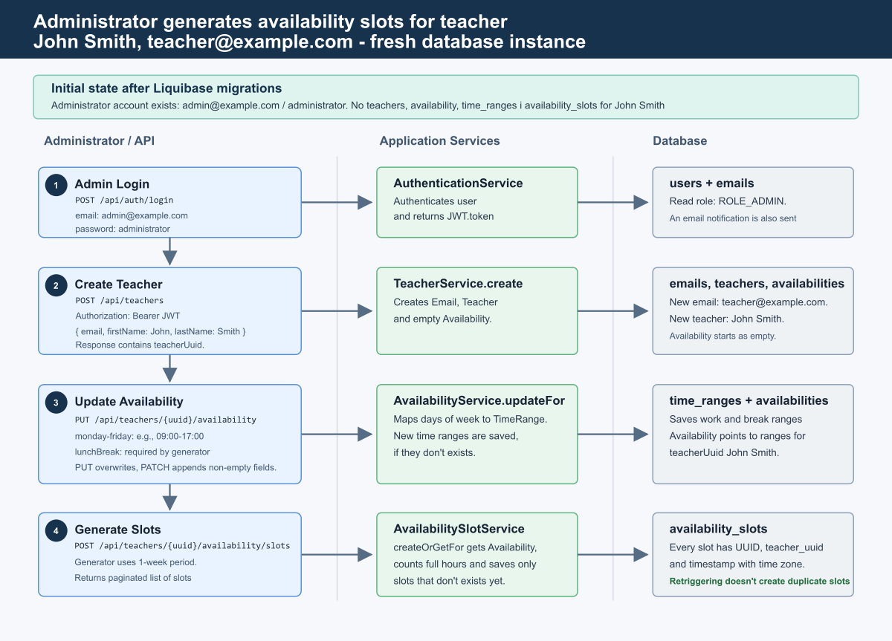

# School Booking Platform Backend
This repository contains the backend service for the **School Booking Platform**.

This README describes the available REST endpoints and the JSON request/response
schemas used by the API.

:globe_with_meridians: Standard port: **8080**

> [!CAUTION]
> This project is a work in progress. The API may change and is not yet stable.
> We recommend rebuilding the docker image and checking the README for updates
> before using it in production.

> [!TIP]
> This version is not stable and so you may crush with the database. If you want to reset the database, you can use the following command:
> ```bash
> docker-compose down -v && docker-compose up -d
> ```

## Requirements
Minimum recommended environment to run the project locally:

- Java 17 (or newer) and a compatible JDK installed (or use the bundled `./mvnw` wrapper).
- Maven (if not using `./mvnw`).
- PostgreSQL 12+ (for production/local DB). Connection is configured via Spring properties (see `application.properties`).
- Docker & Docker Compose (recommended for local development and MailHog service).
- Optional: MailHog for capturing emails locally (SMTP on 1025, UI on 8025).

## :shield: Authentication
- The service uses **JWT bearer tokens**.
- Obtain a token by calling the login endpoint. Use the returned token as an
  `Authorization: Bearer <token>` header for protected endpoints.

Recent fix: the authentication flow now properly surfaces error messages when authentication fails. The security configuration was also adjusted to ensure unauthenticated GET access to certain endpoints where intended.

## :door: Endpoints
(Existing endpoints retained — see below for full list)

### New: Students module
This release introduces a Students module to manage students in the system.

Key points:

- JPA `Student` entity with soft-delete support (logical deletion flag).
- `StudentRepository`, `StudentService` and `StudentServiceImpl` with standard CRUD operations.
- `StudentController` exposing endpoints secured with `ADMIN` role where noted.
- DTOs and MapStruct-based `StudentMapper` (mapper uses `EmailRepository` to resolve/create `Email` entities when needed).
- Liquibase changeset added to create the `students` table and updated master changelog.
- Spring Data paging support is used for list endpoints.

Student endpoints (examples):

- `GET /api/students` — paged list of students (ADMIN only)
  - Query params: `page` (0-based), `size`, `sort`
  - Returns: `Page<StudentDto>`

- `POST /api/students` — create student (ADMIN only)
  - Request JSON example:
    ```json
    {
      "email": "student@example.com",
      "firstName": "Alice",
      "lastName": "Johnson"
    }
    ```
  - Response: `StudentDto` with created entity info

- `GET /api/students/{id}` — get single student by numeric ID (ADMIN only)

Errors: standard HTTP codes (400 on validation, 401/403 for auth, 404 when not found).

For further details see the Student DTOs and controller source in `src/main/java`.

---

### 1) :unlock: `POST /api/auth/login`
Description: Authenticate a user and obtain an access token.

Request JSON:
```json
{
  "email": "user@example.com",
  "password": "yourPassword"
}
```
Validation:
- `email`: required, must be a valid email format
- `password`: required, non-empty

Response JSON (200):
```json
{
  "token": "<jwt-token-string>"
}
```
Errors:
- **400 Bad Request** — on validation errors for email/password
- **401 Unauthorized** — when credentials are invalid

### 2) :lock: `GET /api/emails`
Description: Retrieve a paginated list of stored emails. This endpoint is
protected and requires a valid bearer token with `ADMIN` role.

Authentication: set header

Authorization: `Bearer <token>`

**Query parameters (optional):**
- `page` (int) — page index, 0-based (default depends on Spring but commonly 0)
- `size` (int) — page size (number of items per page)
- `sort` (String) — sort specification, e.g. `sort=value,asc` or `sort=id,desc`

Response JSON (`Page<EmailDto>`):

The endpoint returns Spring's Page object serialized to JSON. Important fields:
```json
{
  "content": [
    {
      "id": 1,
      "value": "alice@example.com"
    },
    {
      "id": 2,
      "value": "bob@example.com"
    }
  ],
  "pageable": { /* pageable metadata, see Spring Data Page */ },
  "totalElements": 42,
  "totalPages": 5,
  "last": false,
  "size": 10,
  "number": 0,
  "sort": { /* sort metadata */ },
  "first": true,
  "numberOfElements": 10,
  "empty": false
}
```
Schema for an email item (`EmailDto`):
```json
{
  "id": 123,        // Long
  "value": "string" // email address
}
```
Errors:
- **401 Unauthorized** — when token is missing or invalid
- **403 Forbidden** — when authenticated user does not have ADMIN role

### 3) :mortar_board: Teacher management
The project now exposes REST endpoints to manage Teacher entities. Teachers
have a UUID primary key and are associated one-to-one with an existing `Email`
entity (referenced by `emailId` in the DB). Teachers support soft-delete.

Teachers are now linked to Subjects (many-to-one). The database schema for the teachers table was updated to include `subject_id` and relevant mappings and DTOs were adjusted.

All teacher endpoints require a valid bearer token. Role requirements are
noted per endpoint.

#### `GET /api/teachers`
Description: Retrieve a paginated list of teachers.

Authorization: `Bearer <token>`

Roles: ADMIN only

Query parameters (optional):
- `page` (int) — page index, 0-based
- `size` (int) — page size
- `sort` (String) — sort specification

Response JSON (`Page<TeacherDto>`):
```json
{
  "content": [
    {
      "uuid": "550e8400-e29b-41d4-a716-446655440000",
      "emailId": 123,
      "firstName": "Alice",
      "lastName": "Smith",
      "subjectId": 1
    }
  ],
  "pageable": { /* pageable metadata */ },
  "totalElements": 10,
  "totalPages": 1,
  "size": 10,
  "number": 0
}
```

Schema for `TeacherDto`:
```json
{
  "uuid": "uuid-string",    // UUID
  "emailId": 123,            // Long (ID of Email entity)
  "firstName": "string",
  "lastName": "string",
  "subjectId": 1             // Long (optional)
}
```

#### `GET /api/teachers/{uuid}`
Description: Get a single teacher by UUID.

Authorization: `Bearer <token>`

Roles: ADMIN, STUDENT

Response JSON (`TeacherDto`):
```json
{
  "uuid": "550e8400-e29b-41d4-a716-446655440000",
  "emailId": 123,
  "firstName": "Alice",
  "lastName": "Smith",
  "subjectId": 1
}
```
Errors:
- **404 Not Found** — when teacher with given UUID does not exist
- **401 / 403** — as with other protected endpoints

#### `POST /api/teachers`
Description: Create a new teacher.

Authorization: `Bearer <token>`

Roles: ADMIN only

Request JSON (`CreateTeacherRequestDto`):
```json
{
  "email": "teacher@example.com",  // required, not blank
  "firstName": "John",
  "lastName": "Doe",
  "subjectId": 1
}
```
Notes:
- If the provided email value does not exist in the `emails` table, the
  application will create an `Email` record and associate it with the new
  Teacher.

Response JSON (`TeacherDto`):
```json
{
  "uuid": "550e8400-e29b-41d4-a716-446655440000",
  "emailId": 456,
  "firstName": "John",
  "lastName": "Doe",
  "subjectId": 1
}
```
Errors:
- **400 Bad Request** — on validation errors (e.g. missing/blank email)
- **401 / 403** — as above

#### `PUT /api/teachers/{uuid}`
Description: Update an existing teacher.

Authorization: `Bearer <token>`

Roles: ADMIN only

Request JSON (`UpdateTeacherRequestDto`) — fields are optional and will be
applied if present:
```json
{
  "email": "new-email@example.com",
  "firstName": "NewFirst",
  "lastName": "NewLast",
  "subjectId": 2
}
```
Notes:
- If `email` is provided and does not exist in the `emails` table, a new
  `Email` record will be created and associated with the teacher.

Response JSON (`TeacherDto`): updated teacher representation

#### `DELETE /api/teachers/{uuid}`
Description: Delete (soft-delete) a teacher by UUID.

Authorization: `Bearer <token>`

Roles: ADMIN only

Response JSON (`TeacherDto`): representation of the deleted teacher

Errors common to teacher endpoints:
- **401 Unauthorized** — when token is missing or invalid
- **403 Forbidden** — when authenticated user does not have required role
- **404 Not Found** — when resource (teacher) does not exist

#### Generate availability slots for a new teacher
Use this flow when an admin creates a teacher and wants to generate
availability slots for the next week.



1. **Log in as an admin** and copy the returned JWT token.

```bash
curl -X POST "http://localhost:8080/api/auth/login" \
  -H "Content-Type: application/json" \
  -d "{\"email\":\"admin@example.com\",\"password\":\"secret\"}"
```

2. **Create the teacher** and copy the `uuid` from the response.

```bash
curl -X POST "http://localhost:8080/api/teachers" \
  -H "Authorization: Bearer <token>" \
  -H "Content-Type: application/json" \
  -d "{\"email\":\"john.smith@example.com\",\"firstName\":\"John\",\"lastName\":\"Smith\",\"subjectId\":1}"
```

3. **Set the teacher's weekly availability.**

```bash
curl -X PUT "http://localhost:8080/api/teachers/<teacher-uuid>/availability" \
  -H "Authorization: Bearer <token>" \
  -H "Content-Type: application/json" \
  -d "{\"monday\":{\"startTime\":\"09:00:00\",\"endTime\":\"15:00:00\"},\"tuesday\":{\"startTime\":\"09:00:00\",\"endTime\":\"15:00:00\"}}"
```

4. **Generate slots for the teacher.**

```bash
curl -X POST "http://localhost:8080/api/teachers/<teacher-uuid>/availability/slots?page=0&size=50" \
  -H "Authorization: Bearer <token>"
```

5. **Verify the generated slots.**

```bash
curl -H "Authorization: Bearer <token>" \
  "http://localhost:8080/api/teachers/<teacher-uuid>/availability/slots?page=0&size=50"
```

Notes:
- Slot generation creates missing slots for the next week.
- Re-running the endpoint should return existing teacher/timestamp slots instead of duplicating them.
- Availability timestamps use the teacher's configured time zone.

### 4) :books: Subject management
The project exposes REST endpoints to manage Subject entities ("przedmioty").
Subjects are identified by a numeric ID and typically contain a name and an
optional description.

All subject endpoints require a valid bearer token. Role requirements are
noted per endpoint.

#### `GET /api/subjects`
Description: Retrieve a paginated list of subjects.

Authorization: `Bearer <token>`

Roles: ADMIN only

Query parameters (optional):
- `page` (int) — page index, 0-based
- `size` (int) — page size
- `sort` (String) — sort specification

Response JSON (`Page<SubjectDto>`):
```json
{
  "content": [
    {
      "id": 1,
      "name": "Mathematics",
      "description": "Basic mathematics"
    }
  ],
  "pageable": { /* pageable metadata */ },
  "totalElements": 10,
  "totalPages": 1,
  "size": 10,
  "number": 0
}
```

Schema for `SubjectDto`:
```json
{
  "id": 1,           // Long
  "name": "string",
  "description": "string"
}
```

#### `GET /api/subjects/{id}`
Description: Get a single subject by numeric ID.

Authorization: `Bearer <token>`

Roles: ADMIN, STUDENT

Response JSON (`SubjectDto`):
```json
{
  "id": 1,
  "name": "Mathematics",
  "description": "Basic mathematics"
}
```
Errors:
- **404 Not Found** — when subject with given ID does not exist
- **401 / 403** — as with other protected endpoints

#### `POST /api/subjects`
Description: Create a new subject.

Authorization: `Bearer <token>`

Roles: ADMIN only

Request JSON (`CreateSubjectRequestDto`):
```json
{
  "name": "Mathematics",   // required, not blank
  "description": "Basic mathematics"
}
```

Response JSON (`SubjectDto`):
```json
{
  "id": 42,
  "name": "Mathematics",
  "description": "Basic mathematics"
}
```
Errors:
- **400 Bad Request** — on validation errors (e.g. missing/blank name)
- **401 / 403** — as above

#### `PUT /api/subjects/{id}`
Description: Update an existing subject.

Authorization: `Bearer <token>`

Roles: ADMIN only

Request JSON (`UpdateSubjectRequestDto`) — fields are optional and will be
applied if present:
```json
{
  "name": "Advanced Math",
  "description": "Covers algebra and calculus"
}
```

Response JSON (`SubjectDto`): updated subject representation

#### `DELETE /api/subjects/{id}`
Description: Delete (soft-delete) a subject by ID.

Authorization: `Bearer <token>`

Roles: ADMIN only

Response JSON (`SubjectDto`): representation of the deleted subject

Errors common to subject endpoints:
- **401 Unauthorized** — when token is missing or invalid
- **403 Forbidden** — when authenticated user does not have required role
- **404 Not Found** — when resource (subject) does not exist

### 5) :bookmark_tabs: Lessons management
New in this release: full lesson management API. Lessons represent scheduled
bookings/appointments created by students (consuming availability slots) for a
specific teacher and subject.

Key notes:
- Endpoints:
  - `GET /api/lessons` — list lessons (public, unauthenticated GET allowed)
  - `GET /api/lessons/{id}` — get single lesson (public)
  - `POST /api/lessons` — create lesson (requires ADMIN role)
  - `PUT /api/lessons/{id}` — update lesson (requires ADMIN role)
  - `DELETE /api/lessons/{id}` — delete lesson (requires ADMIN role)
- Security: `GET` endpoints for lessons are accessible without authentication; `POST`/`PUT`/`DELETE` require `ADMIN` role. OpenAPI security requirement was added for mutating operations.
- DTOs added: `CreateLessonRequestDto`, `UpdateLessonRequestDto`, `LessonDto`.
  - `CreateLessonRequestDto` and `UpdateLessonRequestDto` default `maxEnrolled` to `1` and validate that value is greater than `0`.
  - `UpdateLessonRequestDto` no longer contains `subjectId` or `teacherUuid` fields (they were removed to simplify updates).
- Implementation: `Lesson` entity, repository, mapper (`LessonMapper`), and service implementation were added. Liquibase changelog (`010`) creates the lessons table and related constraints.
- Atomic slot consumption: when creating a lesson the implementation saves the lesson and deletes the associated availability slot (consuming the slot). `LessonServiceImpl.create` is annotated with `@Transactional` to ensure both operations are atomic.
- Availability cleanup: expired/old availability slots are cleaned up before fetching slots. `AvailabilitySlotRepository.deleteByTimestampBefore(...)` and `AvailabilitySlotServiceImpl.clearOld()` implement this behavior.

Request example (create):
```json
{
  "teacherUuid": "550e8400-e29b-41d4-a716-446655440000",
  "subjectId": 1,
  "timestamp": "2026-07-10T10:00:00+02:00",
  "maxEnrolled": 1
}
```

cURL example (list lessons - public):
```bash
curl "http://localhost:8080/api/lessons?page=0&size=20"
```

cURL example (create lesson - ADMIN):
```bash
curl -X POST "http://localhost:8080/api/lessons" \
  -H "Authorization: Bearer <token>" \
  -H "Content-Type: application/json" \
  -d '{"teacherUuid":"550e8400-e29b-41d4-a716-446655440000","subjectId":1,"timestamp":"2026-07-10T10:00:00+02:00","maxEnrolled":1}'
```

Errors:
- **400 Bad Request** — validation errors (e.g. maxEnrolled &lt;= 0)
- **404 Not Found** — referenced teacher/subject/slot not found
- **401 / 403** — as with other protected endpoints

## Running locally (development)
There are two common ways to start the application locally:

1) Using Docker Compose (recommended for a quick local environment with PostgreSQL + MailHog):

```bash
# start DB + mailhog and the app (if Dockerfile + compose configured)
docker-compose up -d --build

# stop and remove volumes if you want a clean DB
docker-compose down -v
```

2) Using Maven wrapper (runs against local/Postgres configured in `application.properties`):

```bash
./mvnw spring-boot:run
# or build and run
./mvnw clean package
java -jar target/*.jar
```

Note: The application sets `server.forward-headers-strategy` in `application.properties` to ensure correct handling of forwarded headers when deployed behind a reverse proxy.

## Tests
Run unit and integration tests with Maven:

```bash
./mvnw test
```

Some integration tests rely on a running PostgreSQL instance or Testcontainers; check test profiles and `src/test/resources/application-test.properties` for settings.

## API documentation / Swagger (OpenAPI)
This project includes SpringDoc OpenAPI configuration. When enabled, the API documentation and interactive UI are available at one of the following URLs (depending on SpringDoc version and configuration):

- http://localhost:8080/swagger-ui.html
- http://localhost:8080/swagger-ui/index.html
- OpenAPI JSON: http://localhost:8080/v3/api-docs

How to use the Swagger UI locally:

1. Start the application (see Running locally).
2. Open the Swagger UI URL in a browser.
3. For secured endpoints, click "Authorize" and paste `Bearer <token>` (include the "Bearer " prefix) into the value box.

Example: fetch students (ADMIN role)

```bash
# login to obtain token
curl -X POST "http://localhost:8080/api/auth/login" \
  -H "Content-Type: application/json" \
  -d '{"email":"admin@example.com","password":"secret"}'

# get paged students
curl -H "Authorization: Bearer <token>" "http://localhost:8080/api/students?page=0&size=20"
```

## Database migrations (Liquibase)
Liquibase changelogs are located under `src/main/resources/db/changelog`.
If you run the application with a fresh database, Liquibase will apply the changelogs automatically on startup.

## Notes & operational changes in this release
- OpenAPI (SpringDoc) configuration was added/updated to expose API docs and Swagger UI.
- Spring Data web support was enabled in the main application to allow automatic binding of `Pageable` parameters for paged endpoints.
- Global exception handling was extended to catch and correctly handle `SQLException` (returns appropriate 500/4xx responses with logged details).
- `server.forward-headers-strategy` is set in `application.properties` to support proxy headers when deployed behind a reverse proxy.

## Mail / Email testing
For local development we recommend using MailHog:
- SMTP: `localhost:1025`
- Web UI: `http://localhost:8025`
See `docker-compose` for a MailHog service example.

## Email delivery logging, MailHog (local testing) & Login notifications
The application records each attempted email delivery and persists a delivery log with status and error information.

Key points:

- Model: `EmailDeliveryLog` with fields: `recipient` (Email), `subject`, `body` (TEXT), `status` (PENDING/SENT/FAILED), `createdAt`, `errorMessage`, and soft-delete (`isDeleted`).
- DTO: `SendEmailRequestDto` (validated recipient, subject, body) and `DeliveryStatus` enum.
- Repository: `EmailDeliveryLogRepository` added with helper `findByStatus`.
- Service: `EmailDeliveryService` (interface) and `EmailDeliveryServiceImpl` which:
  - Validates requests
  - Persists an initial delivery log (status PENDING)
  - Sends email via `JavaMailSender`
  - Updates the log to SENT or FAILED and records stacktrace on failure
  - Ensures an `Email` entity exists for the recipient when persisting the log

Sending login notification:

- On successful login the backend triggers a login notification email for the user.

MailHog support (docker-compose):

- A MailHog service has been added to docker-compose for local development and integration tests. MailHog exposes SMTP on port `1025` and a web UI on port `8025`.

Example docker-compose snippet (conceptual):
```yaml
mailhog:
  image: mailhog/mailhog:latest
  ports:
    - "1025:1025"   # SMTP
    - "8025:8025"   # Web UI
  restart: unless-stopped
  healthcheck:
    test: ["CMD", "curl", "-f", "http://localhost:8025" ]
    interval: 10s
    timeout: 2s
    retries: 5
```

Example test Spring properties (`src/test/resources/application.properties`):
```properties
spring.mail.host=localhost
spring.mail.port=1025
spring.mail.username=
spring.mail.password=
spring.mail.properties.mail.smtp.auth=false
spring.mail.properties.mail.smtp.starttls.enable=false
```

## CORS & Security
CORS configuration was extended to expose the `Authorization` header and allow credentials where appropriate to support frontend usage with cookies/authorization headers in cross-origin scenarios.

## Examples (curl)

### Login and get token
```bash
curl -X POST "http://localhost:8080/api/auth/login" -H "Content-Type: application/json" -d \
  "{\"email\":\"admin@example.com\",\"password\":\"secret\"}"
```

### Use token to fetch students (ADMIN only)
```bash
curl -H "Authorization: Bearer <token>" "http://localhost:8080/api/students?page=0&size=10"
```

### Use token to fetch emails (ADMIN only)
```bash
curl -H "Authorization: Bearer <token>" "http://localhost:8080/api/emails?page=0&size=10"
```

### Use token to fetch teachers (ADMIN only)
```bash
curl -H "Authorization: Bearer <token>" "http://localhost:8080/api/teachers?page=0&size=10"
```

### Use token to fetch subjects (ADMIN only)
```bash
curl -H "Authorization: Bearer <token>" "http://localhost:8080/api/subjects?page=0&size=10"
```

### List lessons (public)
```bash
curl "http://localhost:8080/api/lessons?page=0&size=20"
```

### Create lesson (ADMIN)
```bash
curl -X POST "http://localhost:8080/api/lessons" \
  -H "Authorization: Bearer <token>" \
  -H "Content-Type: application/json" \
  -d '{"teacherUuid":"550e8400-e29b-41d4-a716-446655440000","subjectId":1,"timestamp":"2026-07-10T10:00:00+02:00","maxEnrolled":1}'
```

## Further information
- For full API documentation check the project's **OpenAPI/Swagger UI** (URLs above) or consult the controller and DTO source code in `src/main/java/pl/koder95/sbp/backend`.
